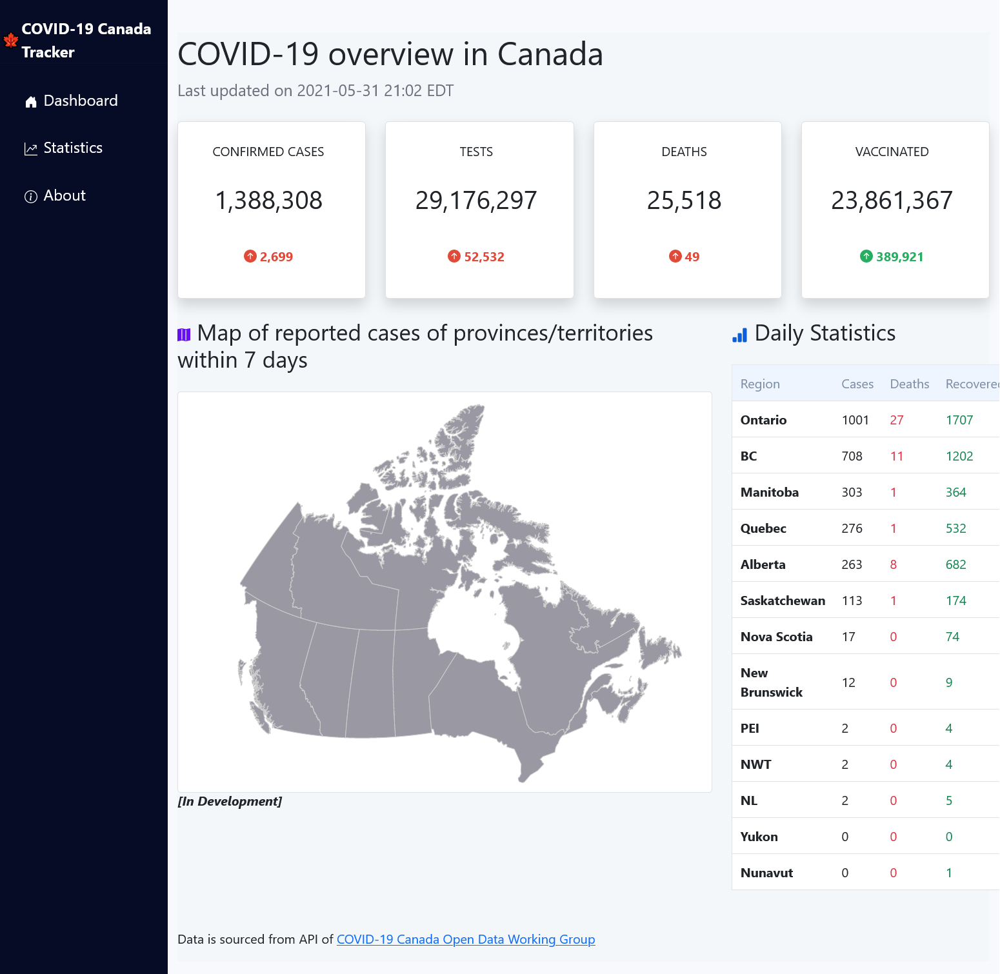

# COVID-19 Canada Cases Tracker

A COVID-19 cases tracker for Canada. Includes charts displaying daily statistics of cases, deaths, tests, and vaccinations for Canada, provinces and territories.

## Preview

## Features
- [x] Cumulative and daily counts of cases, deaths, tests, and vaccinations in Canada.
- [x] Displays region-specific data in graph on Statistic page
- [x] Table displaying daily cases, deaths, and recovered for each province and territory.
- [x] Has responsive design
- [x] Receives up-to-date data via API

## Built with:
- [ReactJS](https://github.com/facebook/react/)
- [Bootstrap](https://github.com/twbs/bootstrap) for UI
- [SWR](https://github.com/vercel/swr) for fast data fetching
- [Recharts](https://github.com/recharts/recharts) for rendering charts
- [react-select](https://github.com/jedwatson/react-select) for select options on Statistics page

## Data courtesy of: 
### [COVID-19 Canada Open Data Working Group](https://opencovid.ca/)

## Favicon Credits:
### [twemoji.twitter.com](https://twemoji.twitter.com/)

## Upcoming Features
- [ ] The Canadian map displays the last 7 days worth of cases for each province and territory
- [ ] Add select buttons to display either cases, deaths, vaccinations, or tests on Statistics page chart
- [ ] Add Pie chart showing cases distribution amongst provinces and territories
- [ ] Refactor CSS to a concise custom theme
- [ ] Fix x-axis ticks in cases chart on Statistics page